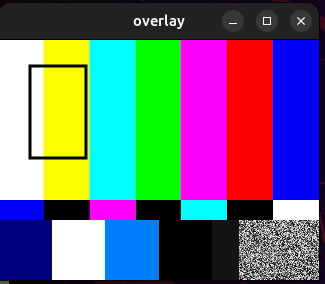

# GStreamer Sync Overlay

This project demonstrates a synchronized video pipeline using GStreamer.

A `DummyCamera` generates RGB video frames and pushes them into a GStreamer
pipeline through `appsrc`. Detection results are generated in a separate
thread and synchronized with video frames using timestamps. Bounding boxes are
drawn using `cairooverlay`.



## Pipeline

```
DummyCamera
    |
    v
appsrc
    |
videoconvert
    |
cairooverlay
    |
videoconvert
    |
autovideosink
```

## Components

### DummyCamera

Simulates a camera source.

Features:

- 640x480 RGB frames
- 30 FPS
- Generates frame timestamps (PTS)

The generated frames are passed to:

```
VideoSource::pushFrame()
```

---

### VideoSource

Handles the GStreamer pipeline.

Responsibilities:

- Creates pipeline elements
- Connects elements
- Pushes frames into `appsrc`
- Keeps frame timestamps

---

### Overlay

Uses GStreamer's `cairooverlay`.

Responsibilities:

- Stores detection results
- Finds the closest detection by timestamp
- Draws bounding boxes on video frames

Example:

```
Frame PTS:      1500 ms
Detection PTS:  1501 ms

Difference:     1 ms

Detection applied
```

---

## Build

Requirements:

- C++17
- CMake >= 3.16
- GStreamer 1.0
- Cairo
- GoogleTest


Install dependencies (Ubuntu):

```bash
sudo apt install \
cmake \
build-essential \
libgstreamer1.0-dev \
libgstreamer-plugins-base1.0-dev \
libcairo2-dev \
libgtest-dev
```

Build:

```bash
mkdir build
cd build
cmake ..
make -j8
```

---

## Run

Start application:

```bash
./overlay
```

A video window opens with generated frames and synchronized bounding boxes.

---

## Tests

Run unit tests:

```bash
ctest --verbose
```

Current tests verify:

- Detection timestamp matching
- Detection timeout handling
- Selection of closest detection

---

## Project Structure

```
gstreamer-sync
|
├── src
│   ├── main.cpp
│   ├── VideoSource.hpp
│   ├── Overlay.hpp
│   └── DummyCamera.hpp
|
├── tests
│   └── OverlayTest.cpp
|
├── CMakeLists.txt
└── README.md
```

## Goal

The project provides a simple foundation for combining camera frames and AI
detection results in a real-time synchronized video pipeline.
