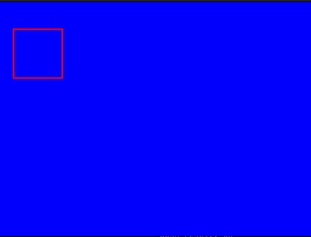
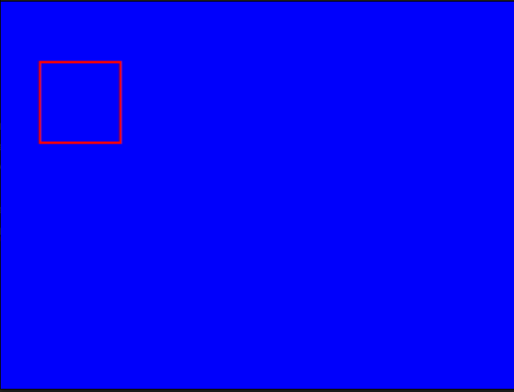

# GStreamer Sync Overlay

This project demonstrates a synchronized video pipeline using GStreamer.

A `DummyCamera` generates RGB video frames and pushes them into a GStreamer
pipeline through `appsrc`. Detection results are generated in a separate
thread and synchronized with video frames using timestamps. Bounding boxes are
drawn using `cairooverlay`.

Simple Demonstration:



## Pipeline

```
DummyCamera
    |
    v
appsrc
    |
videoconvert
    |
cairooverlay
    |
videoconvert
    |
autovideosink
```

## Components

### DummyCamera

Simulates a camera source.

Features:

- 640x480 RGB frames
- 30 FPS
- Generates frame timestamps (PTS)

The generated frames are passed to:

```
VideoSource::pushFrame()
```

---

### VideoSource

Handles the GStreamer pipeline.

Responsibilities:

- Creates pipeline elements
- Connects elements
- Pushes frames into `appsrc`
- Keeps frame timestamps

---

### Overlay

Uses GStreamer's `cairooverlay`.

Responsibilities:

- Stores detection results
- Finds the closest detection by timestamp
- Draws bounding boxes on video frames

Example:

```
Frame PTS:      1500 ms
Detection PTS:  1501 ms

Difference:     1 ms

Detection applied
```

---

## Build

Requirements:

- C++17
- CMake >= 3.16
- GStreamer 1.0
- Cairo
- GoogleTest


Install dependencies (Ubuntu):

```bash
sudo apt install \
cmake \
build-essential \
libgstreamer1.0-dev \
libgstreamer-plugins-base1.0-dev \
libcairo2-dev \
libgtest-dev
```

Build:

```bash
mkdir build
cd build
cmake ..
make -j8
```

---

## Run

Start application:

```bash
./overlay
```

A video window opens with generated frames and synchronized bounding boxes.

---

## Tests

Run unit tests:

```bash
ctest --verbose
```

Current tests verify:

- Detection timestamp matching
- Detection timeout handling
- Selection of closest detection

---

## Project Structure

```
gstreamer-sync
|
├── src
│   ├── main.cpp
│   ├── VideoSource.hpp
│   ├── Overlay.hpp
│   └── DummyCamera.hpp
|
├── tests
│   └── OverlayTest.cpp
|
├── CMakeLists.txt
└── README.md
```

## Synchronization

The video stream and the detection results are produced independently.

### Video

The `DummyCamera` generates a video frame every 33 ms (30 FPS). Each frame
receives a Presentation Timestamp (PTS), which is preserved when the frame is
pushed into the GStreamer pipeline.

Example:

```
Frame 1 -> PTS = 1000 ms
Frame 2 -> PTS = 1033 ms
Frame 3 -> PTS = 1066 ms
```

### Detection

The detection thread simulates an AI inference process. Every detection also
receives a timestamp. To imitate processing latency, a small random delay is
added.

Example:

```
Detection 1 -> PTS = 1015 ms
Detection 2 -> PTS = 1062 ms
Detection 3 -> PTS = 1098 ms
```

### Matching

Whenever `cairooverlay` draws a video frame, it receives the frame's timestamp.
The overlay searches all available detections and selects the one whose
timestamp is closest to the current frame.

Example:

```
Current frame:      1066 ms

Available detections:
1015 ms
1062 ms   <-- selected
1098 ms
```

If the smallest timestamp difference is within the configured tolerance
(currently 200 ms), the corresponding bounding boxes are drawn. Otherwise,
nothing is rendered for that frame.

This approach keeps the video and detection streams synchronized even when the
detection process introduces variable processing delays.


## Goal

The project provides a simple foundation for combining camera frames and AI
detection results in a real-time synchronized video pipeline.
